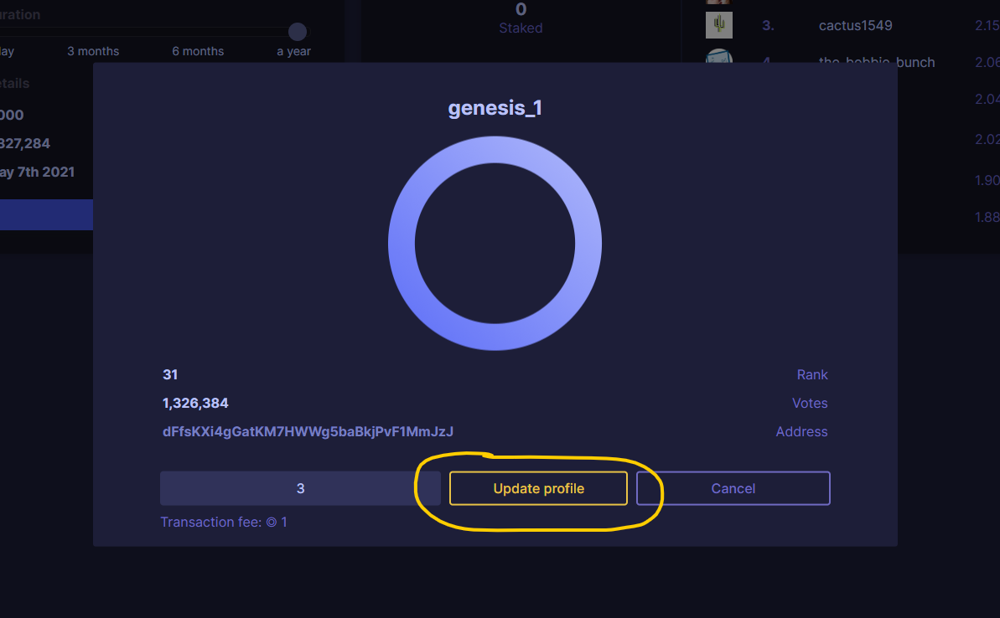

# Creating a Validator

This guide will teach you how to register a validator and set up a validator profile using the Compendia Web Wallet.

## Register a Validator

*If you only want to launch relay nodes you can skip registering a validator.*

1. Open [nOS Web Wallet](https://wallet.nos.dev)

2. Log in with your mnemonic key, or create a new wallet.
**Make sure to store your mnemonic key in a safe and secure location!**

3. Make sure you have at least 100 coins in your wallet. 
If you're on the public testnet, you can click **Get coins** to get free coins (You can request free coins once every 3 days):
 

4. On the right next to "Validators", click **Register Validator**.
 
5. Enter your desired username *(lowercase letters, numbers, and underscores only)* for your Validator and click "Register".
 
6. Users can now vote for your Validator by entering your username in **Search Validator**, or by clicking your username in the Validators list.
 
7. You can vote for yourself by clicking **Find Validator** and entering your username. Then click **Vote**.

## Create a Profile

You can set a logo and a description for your validator. This data is hosted on the network using the IPFS protocol.

Logos and descriptions are visible on the wallet and explorer.

1. Select your Validator by clicking on your yellow name on top of the Validators list.
 
2. Click the **Update Profile** button.
 
3. In your description, enter a short value proposal for potential voters (if any), and click submit.
4. Go to **Update Profile** again and upload your logo.

***Note:** Any offensive, 18+, and/or illegal content will cause your custom data to be permanently hidden from the official wallet and explorer.*