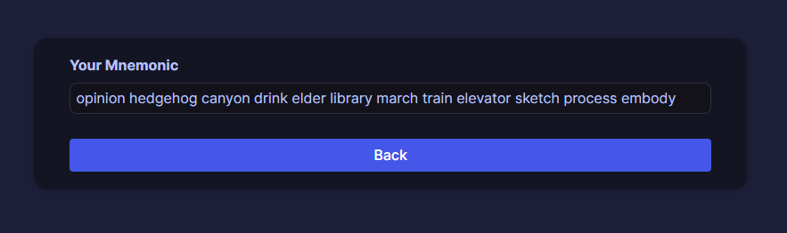
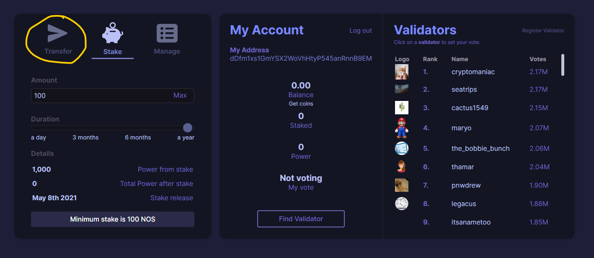
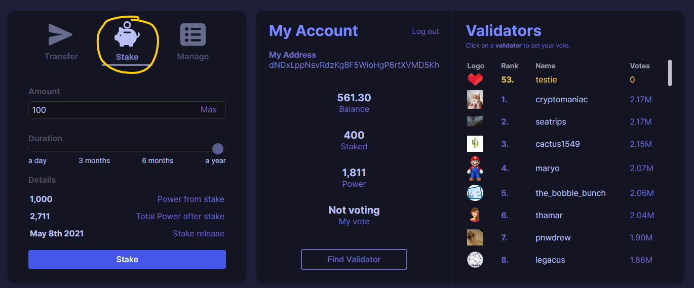
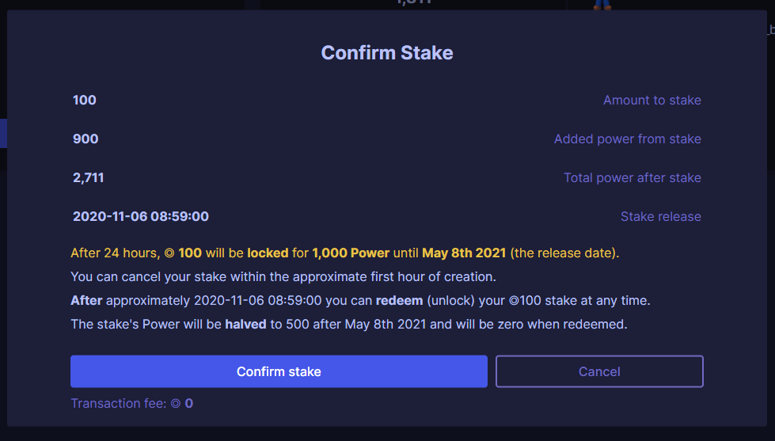

# Wallet

## Create & Log In

1. To create a new wallet, go to the Web Wallet and click "Create Account".  

2. You'll see a unique 12-word mnemonic. This mnemonic represents a *private key* for your wallet.
*Note:* Your mnemonic gives access to your wallet, so don't share it with anyone!
1. Save your mnemonic somewhere safe.
2. Copy your mnemonic, click Back, and paste it in the log in screen.
3. You have now logged in to your wallet. 

If you're logged in to the Testnet, you can get free coins by clicking the "Get coins" button below your balance.

## Transfer

To transfer coins, click the Transfer button on the left panel:

Once you're in the Transfer panel, simply enter the amount of BIND you want to transfer and the address of the receiver.

When you click **Send**, you'll get a confirmation screen with the information you entered.

The transaction fee is displayed below the Send button.

Click **Send** to send the transaction. Your balance and transaction history will be automatically updated on the next block (a few seconds).

## Vote

To vote for a validator, click on a validator from the **Validators** list on the right, or click on **Find Validator** to enter a validattor's username manually.

The validator's votes will increase by your Power.

Congratulations! Your vote has an active effect on the rankings of the validators on the network, and the network's databases that are used by apps!

## Stake

To stake coins, make sure you're on the Stake panel:

Enter the amount you want to stake (minimum 10,000 BIND for mainnet), and the duration.

You can review how your stake will increase your vote power under **Details**.

Once you're ready to stake, click **Stake**. You'll see a confirmation screen:

Click **Confirm stake** to stake your coins.